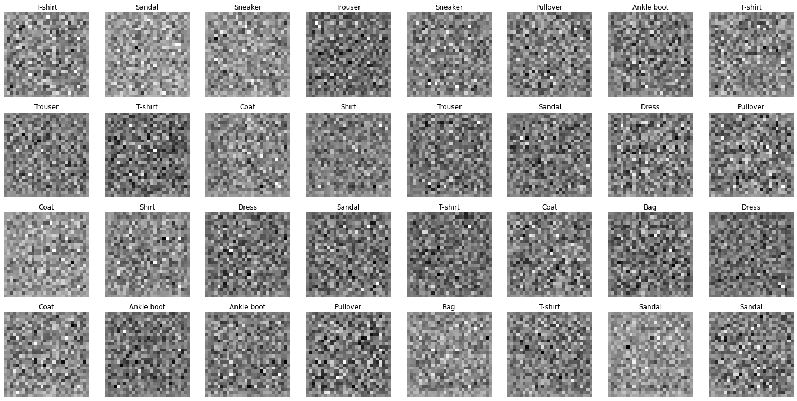
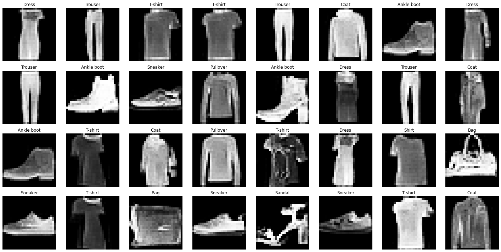

# Generative Adversarial Network for Fashion MNIST

Generative Adversarial Networks (GANs) are a powerful class of neural networks that are used for unsupervised learning. It was developed and introduced by Ian J. Goodfellow in 2014. GANs are basically made up of a system of two competing neural network models which compete with each other and are able to analyze, capture and copy the variations within a dataset.

Tensorflow implementation of Generative Adversarial Networks (GAN) for fashion MNIST dataset.

## My thoughts

This is what the generator generated before any training.

Initially for the first 100 epochs I kept the learning rate of the discriminator to 1e-3 so that the generator could learn much faster, which actually caused bumps for the generator. After that the I reduced the epoch to 1e-4 stabilizing the generator. From 100 to 150 epochs the generator averaged a loss of about 1.6-1.7 then it reduced to 1.5. The discriminator on the other hand managed to stay on a lower bound loss of 0.5.

### Results after 400 epochs

Some classes from original fashion mnist are actually missing. The generator focused more on shirts, trousers etc. maybe because it learned these more quickly than others. It is not really a problem as we don't have any control over its feature mapping with the latent space. Maybe someday, I would update this repo by adding a CGAN implementation for this dataset.

That being said, the results really looked like they are picked from the original fashion MNIST dataset. What's your opinion on that :)
Go ahead and play with this model.

# Update - CGAN

Added a conditional GAN for this dataset. This solves the issue where a lot of classes were missing while generating from the traditional unconditioned GAN.

Gray noise before training, with class labels.

Results after training for 400 epochs along with their class labels

## The Dataset

    Fashion MNIST

Fashion-MNIST is a dataset of Zalando's article images—consisting of a training set of 60,000 examples and a test set of 10,000 examples. Each example is a 28x28 grayscale image, associated with a label from 10 classes.

**You can download the dataset by clicking** [here](https://github.com/zalandoresearch/fashion-mnist)

